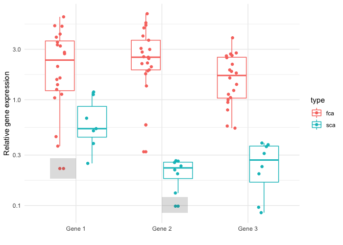
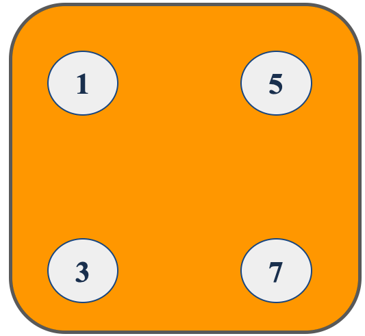
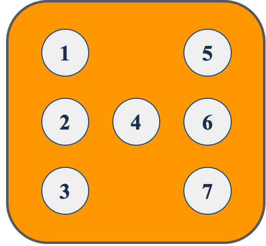
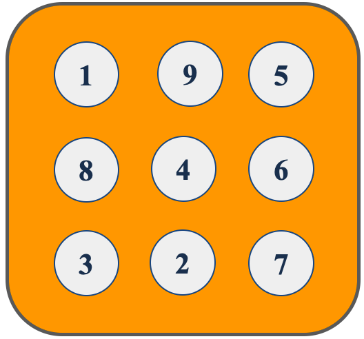
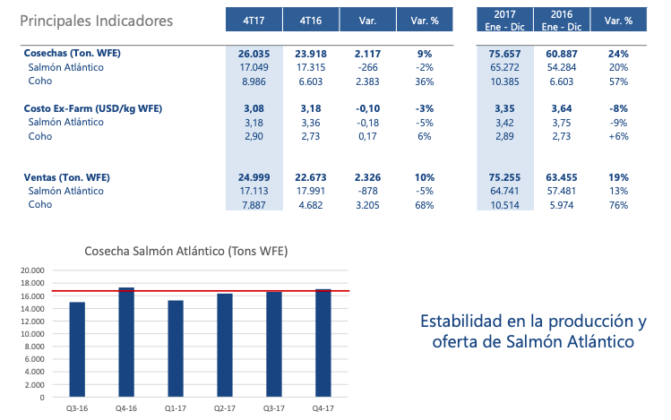
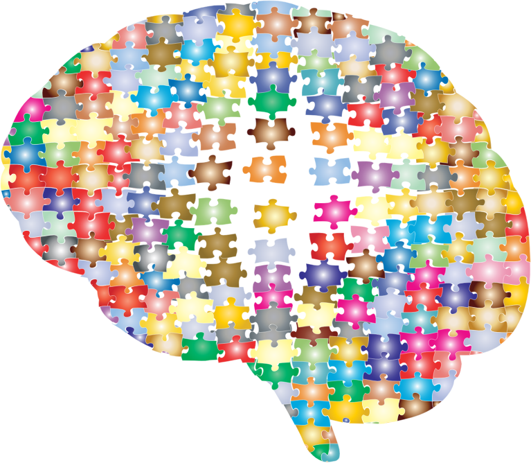
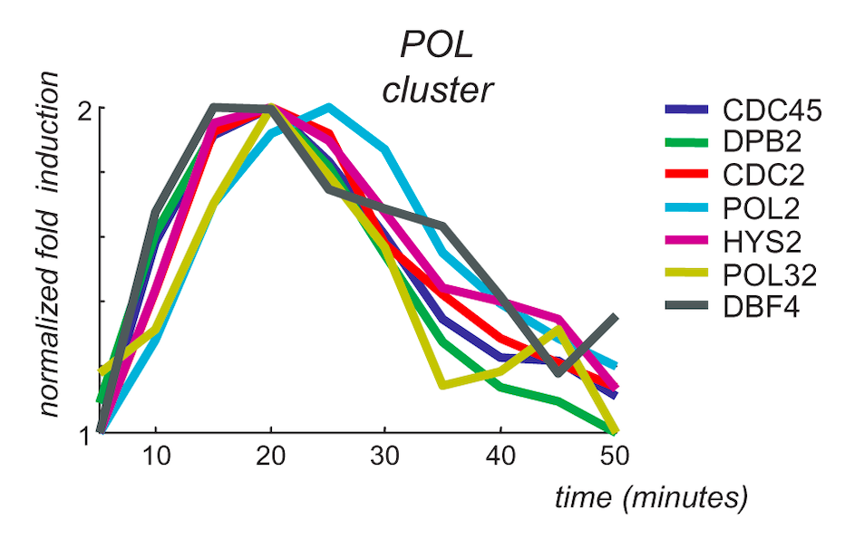

```{r setup, include=FALSE}
knitr::opts_chunk$set(echo = FALSE)
library(MASS)
library(psych)
library(ggplot2)
library(fishdata)
library(pander)
library(dplyr)
require(gridExtra)
library(grid)
```

## PLAN DE LA CLASE

**Claves para comunicar EDA de forma efectiva**
    
- Sentidos e información.
- Memoria de corto plazo.
- La importancia de los patrones.
- Las tortas son para compartir.
- Barras y variabilidad. 

## SENTIDOS E INFORMACIÓN

\columnsbegin
\column{.6\textwidth}

|  **Sentidos** | **Información**   |
|:---:|:---:|
|  Ver |  83 % |
|  Escuchar | 11 %  |
| Oler  | 3%  |
| Tocar  |  1,5 % |
| Degustar  |  1 % |

\column{.4\textwidth}
```{r, echo=FALSE, out.width = '90%' }

```
\columnsend

## COMUNICA TUS DATOS VISUALMENTE.

```{r, echo=FALSE, out.width = '90%' }

```

## MEMORIA DE CORTO PLAZO.

```{r, echo=FALSE, out.width = '70%' }

```

## MEMORIA DE CORTO PLAZO.

```{r, echo=FALSE, out.width = '70%' }

```

## MEMORIA DE CORTO PLAZO.

```{r, echo=FALSE, out.width = '70%' }

```


## EVITA COMUNICAR MUCHA INFORMACIÓN.

```{r, echo=FALSE, out.width = '100%' }

```


## LA IMPORTANCIA DE LOS PATRONES 

\columnsbegin
\column{.6\textwidth}
```{r, echo=FALSE, out.width = '90%' }

```
\column{.4\textwidth}
```{r, echo=FALSE, out.width = '90%' }

```
\columnsend

## BUSCA Y COMUNICA EL PATRÓN DE TUS DATOS

```{r, echo=FALSE, out.width = '90%' }

```

[Farina et al. 2008](https://doi.org/10.1371/journal.pcbi.1000141)

## LAS TORTAS SON PARA COMPARTIR

**Principales problemas**  
1. No somos buenos para las proporciones.  
2. Las proporciones esconden los datos originales.  

```{r, echo=FALSE, out.width = '80%' }

My_Theme = theme(
  axis.title.x = element_text(size = 18),
  axis.text.x = element_text(size = 18),
  axis.title.y = element_text(size = 18),
  axis.text.y = element_text(size = 18))

# Pie Chart with Percentages
count.data <- data.frame(
  Especie = c("Trucha", "Salmon del Pacifico", "Salmón del Atlántico"),
  n = c(35, 74, 279),
  prop = c(9, 19, 72)
)

# Add label position
count.data <- count.data %>%
  arrange(desc(Especie)) %>%
  mutate(lab.ypos = cumsum(prop) - 0.5*prop)

mycols <- c("#0073C2FF", "#EFC000FF", "#CD534CFF")

ggplot(count.data, aes(x = "", y = prop, fill = Especie)) +
  geom_bar(width = 2, stat = "identity", color = "white") +
  coord_polar("y", start = 0)+
  geom_text(aes(y = lab.ypos, label = prop), color = "white", size=12)+
  scale_fill_manual(values = mycols) +
  theme_void(base_size = 12)

```

## SOLUCIÓN: BARRAS ORDENADAS Y DATOS ORIGINALES

```{r, echo=FALSE, out.width = '80%'}
# Grafica de barras
centros <- c(35, 74, 279)
Especie = c("Trucha", "Salmon del Pacifico", "Salmón del Atlántico")
salmon<-data.frame(Especie, centros)
s<- ggplot(data=salmon, aes(x=Especie, y=centros)) +
  geom_bar(stat="identity", fill="steelblue")+
  geom_text(aes(label=centros), vjust=1.6, color="white", size=5)+
  theme_minimal()
s+ My_Theme
```

## BARRAS Y VARIABILIDAD.

**Principales problemas**  
1. La escala del eje y.  
2. Se enmascara la variabilidad.  

```{r, warning=FALSE, message=FALSE, out.width = '80%'}
set.seed(123)
fctr <- rbinom(40, 1, 0.8)
w.means <- c(30, 35) # Complete dominance
w.sd    <- c(5, 5)
weight <- rnorm(40, w.means[factor(fctr)], w.sd[factor(fctr)])
camaron <- data.frame(cbind(fctr, weight))

camaron$fctr<-as.factor(camaron$fctr)
camaron$fctr <- factor(camaron$fctr, labels=c("Control", "Tratamiento"))

Camaron_summary <- camaron %>% # the names of the new data frame and the data frame to be summarised
  group_by(fctr) %>%   # the grouping variable
  summarise(mean_CA = mean(weight),  # calculates the mean of each group
            sd_CA = sd(weight), # calculates the standard deviation of each group
            n_CA = n(),  # calculates the sample size per group
            SE_CA = sd(weight)/sqrt(n())) # calculates the standard error of each group

camaronPlot <- ggplot(Camaron_summary, aes(fctr, mean_CA)) + 
                   geom_col(fill = "#0073C2FF") +  
                   geom_errorbar(aes(ymin = mean_CA - sd_CA, ymax = mean_CA + sd_CA), width=0.5)

camaronPlot + labs(y="weight (g) ± s.d.", x = "") + theme_minimal() + My_Theme
```

## SOLUCIÓN: BOXPLOT.

```{r}
camaronBoxplot<- ggplot(camaron, aes(x=fctr, y=weight, fill=fctr)) +
    geom_boxplot() +
    geom_jitter(color="blue", size=2, alpha=1) +
    theme_minimal() + 
    theme(
      legend.position="none",
      plot.title = element_text(size=11)
    ) +
    xlab("")
camaronBoxplot + My_Theme + labs(y="weight (g) ± s.d.", x = "")
```

## RESUMEN DE LA CLASE

**5 claves para comunicar EDA de forma efectiva.**
    
1. Comunica tus datos visualmente.  
2. Evita compartir mucha información.  
3. Busca y comunica el patrón de tus datos.  
4. Evita tortas, prefiere barras ordenadas y datos originales.  
5. Desconfía de barras que muestran variabilidad, perfiere boxplot.   
